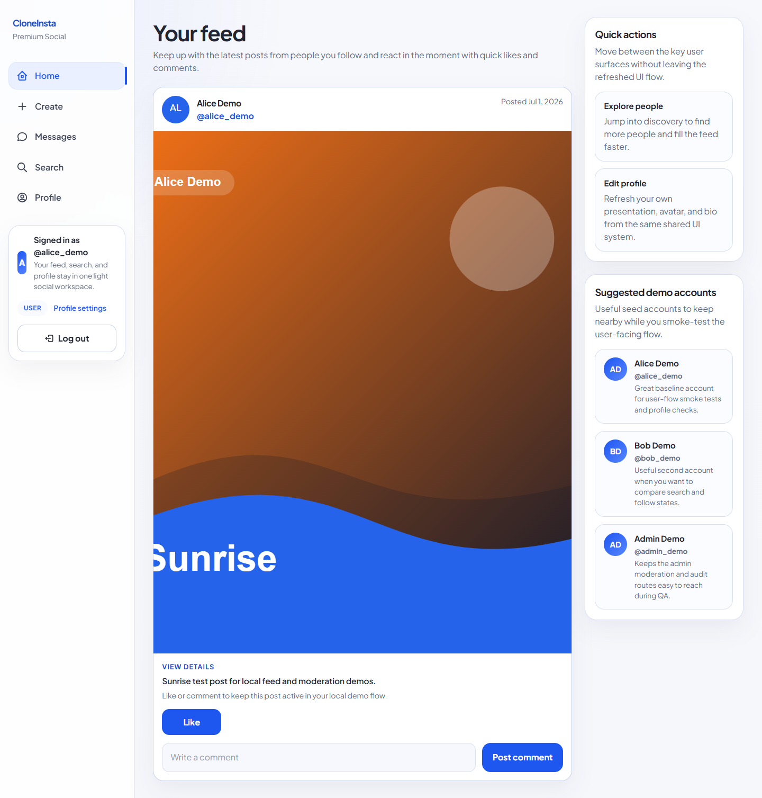
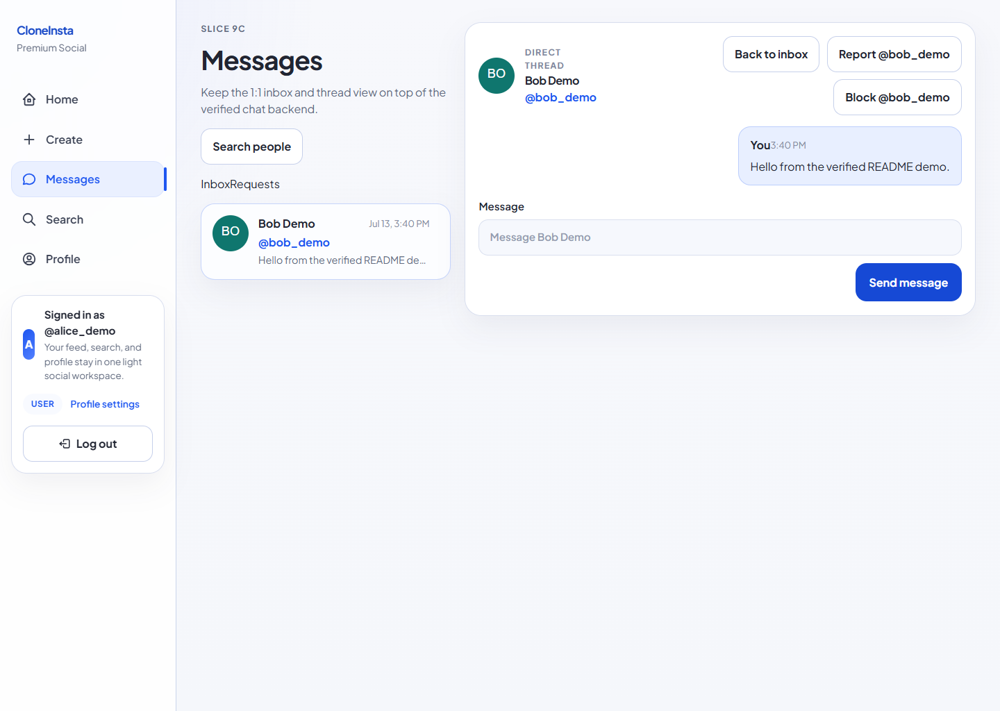
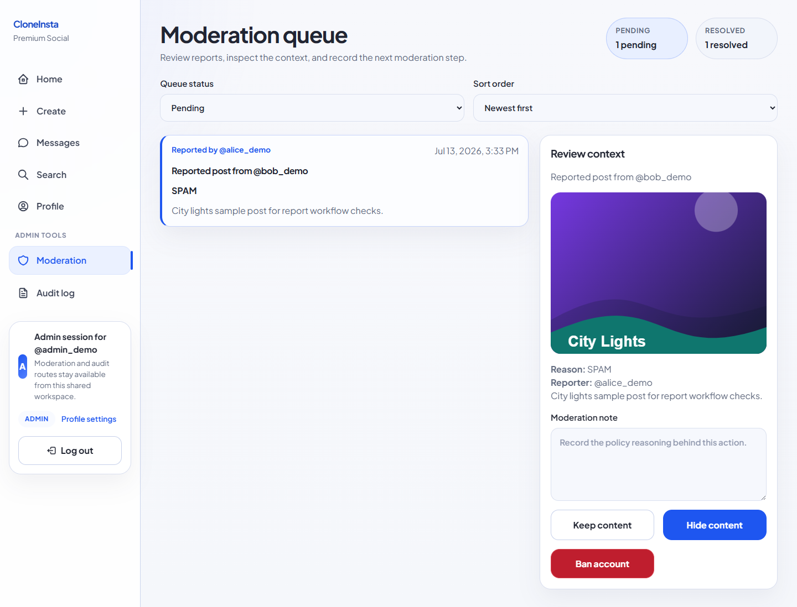

# CloneInsta

CloneInsta is a local-first, full-stack photo-sharing social application built as a Software Engineering project. It takes inspiration from the feature categories of modern social products while using original branding, UI, sample content, and implementation.

It is designed to be easy to run locally, demonstrate safely, and explain in an academic defense: the backend keeps a route/controller/schema/service/repository flow, the React client uses protected routes and a shared session layer, and PostgreSQL stores the durable social, moderation, audit, and messaging data.

## Highlights

- Secure registration, login, short-lived access tokens, rotating HttpOnly refresh cookies, CSRF checks, and role guards.
- Profile editing, safe user search, follow/block controls, image posts, cursor-paginated feed, likes, and comments.
- Report submission, moderation queue, safe audit logs, and admin-only actions.
- Direct messaging with REST persistence, Socket.IO updates, message requests, read state, rate limits, block safety, and user-report hooks.
- Prisma migrations, reproducible demo seed data, database-backed integration tests, and a Postman collection for the REST API.

## Screenshots

<p align="center">
  
</p>

<p align="center">
  
</p>

<p align="center">
  
</p>

The screenshots use the local demo seed; no third-party branding or production user data is included.

## Stack

| Area            | Technology                                              |
| --------------- | ------------------------------------------------------- |
| Client          | React, TypeScript, Vite, React Router                   |
| Server          | Express 5, TypeScript, Zod                              |
| Data            | PostgreSQL 16, Prisma 7                                 |
| Realtime        | Socket.IO                                               |
| Tests           | Vitest, Supertest, real PostgreSQL integration database |
| Local services  | Docker Compose, PostgreSQL, Mailpit                     |
| API exploration | [Postman collection](docs/postman_collection.json)      |

## Prerequisites

- Node.js 24 or newer
- npm 11 or newer
- Docker Desktop with Docker Compose

## Quick start

```bash
git clone https://github.com/kiet1i38/project-insta.git
cd project-insta

npm ci
docker compose up -d postgres mailpit

# Optional but recommended: copy the documented local defaults.
# PowerShell:
Copy-Item client/.env.example client/.env
Copy-Item server/.env.example server/.env

npm run db:validate
npm run db:migrate:dev
npm run db:seed
npm run mail:verify --workspace server
npm run dev
```

Open the app at [http://localhost:5173](http://localhost:5173). The API health endpoint is [http://localhost:3001/api/v1/health](http://localhost:3001/api/v1/health), and Mailpit is available at [http://localhost:8025](http://localhost:8025).

The default local values in the example environment files use the Docker Compose PostgreSQL database. Do not commit the copied `.env` files.

## Demo accounts

After `npm run db:seed`, use these local-only accounts:

| Role  | Username     | Password        |
| ----- | ------------ | --------------- |
| User  | `alice_demo` | `UserDemo123!`  |
| User  | `bob_demo`   | `UserDemo123!`  |
| Admin | `admin_demo` | `AdminDemo123!` |

`npm run db:seed` is idempotent and resets mutable demo artifacts such as sessions, interactions, moderation data, and direct-message data. Run it again after browser smoke tests that alter seeded data.

## Useful commands

| Command                                  | Purpose                                                               |
| ---------------------------------------- | --------------------------------------------------------------------- |
| `npm run dev`                            | Start the Express API and Vite client together.                       |
| `npm run db:validate`                    | Validate the Prisma schema.                                           |
| `npm run db:migrate:dev`                 | Apply development migrations to `cloneinsta`.                         |
| `npm run db:migrate:test`                | Recreate/apply migrations to the isolated `cloneinsta_test` database. |
| `npm run db:seed`                        | Restore safe local demo data.                                         |
| `npm run mail:verify --workspace server` | Send a local SMTP proof message and confirm Mailpit received it.      |
| `npm run lint`                           | Run client and server linting.                                        |
| `npm test`                               | Run the full workspace test suite.                                    |
| `npm run build`                          | Type-check and build both workspaces.                                 |

For the standard local verification pass:

```bash
npm run db:validate
npm run db:migrate:test
npm run lint
npm test
npm run build
npm run db:seed
```

The Prisma-backed server suites share `cloneinsta_test`, so do not run multiple focused server test processes in parallel unless each process has an isolated database.

## API and realtime demo

Import [docs/postman_collection.json](docs/postman_collection.json) into Postman. It contains 38 practical requests covering all 34 implemented REST method/path contracts, including:

- Demo login helpers that save the access token.
- Cookie, Origin, and CSRF requirements for refresh/logout.
- User, post/comment, report, admin/audit, and conversation endpoints.
- Request folders, block safety, and report-user behavior for direct messages.

The collection is intentionally REST-only. Socket.IO is the separate realtime transport for authenticated conversation updates, read-state changes, reconnect sync, and message delivery.

## Architecture and security choices

The backend follows a modular layered flow:

```text
route -> controller -> Zod schema -> service -> repository -> Prisma/PostgreSQL
```

- Controllers own HTTP parsing and response shaping.
- Zod schemas reject malformed or mass-assignment-style inputs before business logic.
- Services own authorization and business rules; repositories own database access.
- Safe DTOs avoid returning password hashes, refresh tokens, or private audit metadata.
- Refresh tokens are hashed in PostgreSQL and delivered only through HttpOnly cookies. Refresh and logout also require allowed-origin and CSRF checks.
- Reports and sensitive messaging actions produce minimal audit metadata; direct-message text is never copied into a moderation report audit entry.
- The mail boundary validates SMTP settings, keeps delivery failures generic, and writes no recipient, token, URL, or provider-error text to its failure log. `mail:verify` proves the local Mailpit path without adding an HTTP endpoint.

See `instruction.html` locally for the student-focused explanation of the data flow, testing strategy, edge cases, and defense notes. `flag.md` and `plan.md` are intentionally local checkpoint files and are not part of the GitHub repository.

## Quality gates

GitHub Actions runs `npm ci`, Prisma validation, test-database migrations, lint, tests (including the isolated mail-boundary regressions), and build on pushes and pull requests to `main`. CodeQL scans the JavaScript/TypeScript source on pushes, pull requests, and a weekly schedule; Dependabot monitors npm, GitHub Actions, and Docker Compose dependencies weekly. Run `npm run mail:verify --workspace server` locally when Mailpit delivery itself needs proving. Local browser QA uses `http://localhost:5173` and re-seeds the demo database after flows that mutate it.

## Scope

CloneInsta is GitHub-ready and local-run first. The account-lifecycle milestone is in progress: its local SMTP/Mailpit foundation exists, while email-verification and password-reset persistence, routes, and UI are still pending. It is not presented as a production deployment: hosted infrastructure, notifications, private accounts, and broader social features remain outside the current project scope.
